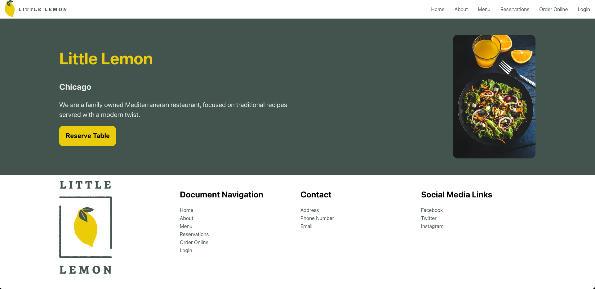
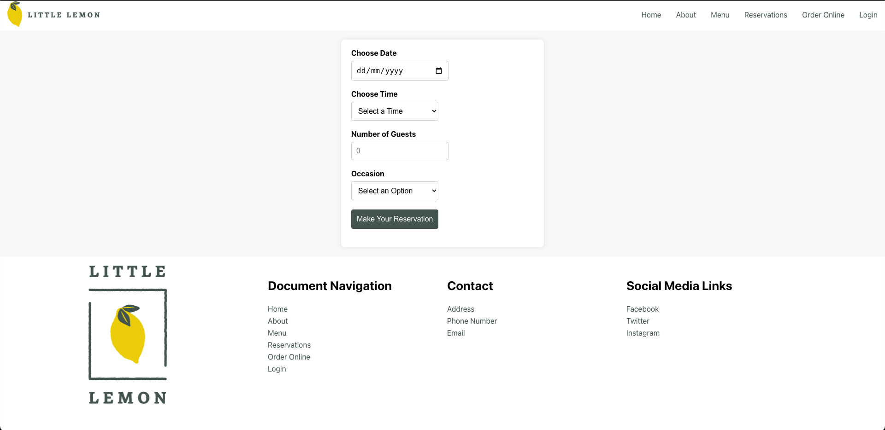
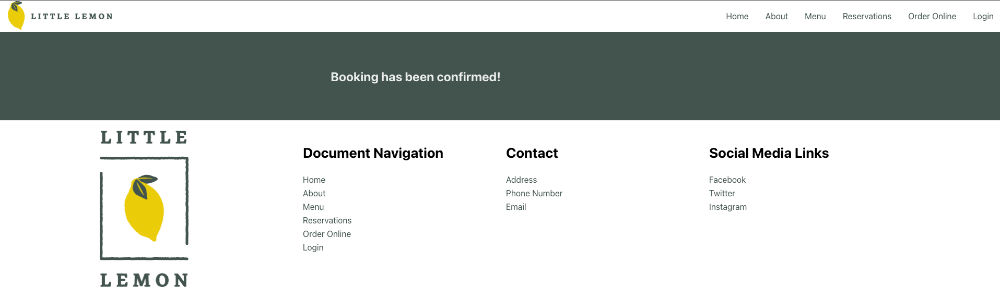

# Little Lemon Booking Website

## Project Overview

This project was developed as part of Meta's Front-End Development course on Coursera. It represents the final project of the Front-End Development Track.

The website demonstrates the implementation of a booking application for the Little Lemon Website. It was built using React components to illustrate proficiency in using React for web development. Additionally, it includes the use of API calls.

### Screenshots

Below are some screenshots of the application, highlighting the booking functionality.

